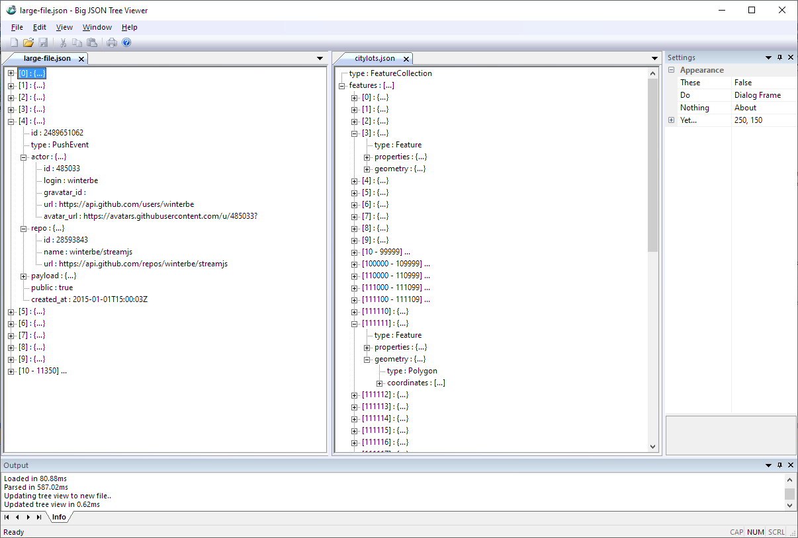

# Big JSON Tree Viewer (for Windows)

A simple Windows desktop application for viewing large (100MB+) JSON files in a tree view.

  
  

This tool is in very early development, but being made available as is now to fill an apparent
gap in such tooling. At time of writing, the author is not aware of any other similar tool that
is free, open source, runs as a Windows desktop application, and can comfortably handle large
files while providing an intuitive, functional interface.

## Features

* Fast loading (<1 second for 250MB)
* Intuitive tree view 
* Dynamic folding of large arrays
* Multiple Document Interface with dockable tree view panels - view multiple files side by side!
* [More to come...](./TODO.txt)

## Downloading Releases

TODO

## Building

To build the application for Windows, you need Visual Studio 2022. The .sln file is in the root
directory.

## Can I help?

Feel free to submit bug reports or suggestions/feature requests to the issue tracker, but please
first check existing issues and [TODO.txt](./TODO.txt).

Given the very early state of this tool, multiple contributors are likely to bump heads. If
you'd like to contribute, please read [CONTRIBUTING.md](./CONTRIBUTING.md).
